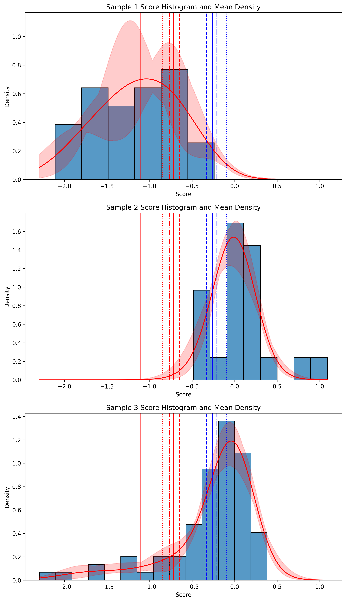

# Calibration Summary Utils
>Utilities for summarizing assay calibration model fits to obtain functional evidence score thresholds.
## Installation

To install the Calibration Summary Utils, clone the repository and install the required dependencies:

```bash
conda create -n assay_calibration python=3.10
conda activate assay_calibration
git clone https://github.com/Dzeiberg/calibration_summary_utils.git
cd calibration_summary_utils
pip install .
```

## Input Data
A scoreset can be defined by a `.csv` file with `scores` and `sample_assignments` columns. Each variant in the scoreset is designated a row in the file.

- The `scores` column contains continuous functional scores for each variant.

`sample_assignments` indicates the sample in which the variant is used for the modeling procedure.
- `sample_assignments`= 0 indicates the variant is pathogenic or likely pathogenic (P/LP)
- `sample_assignments`= 1 indicates the variant is benign or likely benign (B/LB)
- `sample_assignments`= 2 indicates the variant is present in the population to which the scoreset is calibrated (e.g., gnomAD)

Samples `0`,`1`, and `2` are required for calibration. The positive likelihood ratio ($LR^+$), also referred to as `OddsPath`, is computed as the ratio of densities of the P/LP sample (sample `0`) to the density of the B/LB sample (sample `1`). The prior probability of pathogenicity, a necessary value for calibration, is calculated with respect to sample `2`. Any additional samples are not required but can be included.


## Basic Usage
Below is an example script for fitting 10 calibrations to a dataset and summarizing the fits

```python
from pathlib import Path
from tqdm import tqdm
from assay_calibration.data_utils.dataset import BasicScoreset
from assay_calibration.fit_utils.fit import Fit
from calibration_summary_utils.summarize_fits import summarize_fits

data_filepath = Path("example_table.csv")
scoreset = BasicScoreset.from_csv(example_data)
fits = []
for fitNum in tqdm(range(10)):
    fit = Fit(scoreset)
    fit.run(core_limit=1, num_fits=1, component_range=[2, 3])
    fits.append(fit)
summary_filepath = "summary.json"
fig_filepath = "fit_visualization.png"
summarize_fits(fits,scoreset,summary_file_savepath=summary_filepath,
                figure_savepath=fig_filepath,)
```

## Example 
### Visualization of model fit


### Example summary.json file
```json
{
    "median_prior": 0.21,
    "final_pathogenic_thresholds": [
        -0.65,
        -0.72,
        -0.76,
        -0.85,
        -1.11
    ],
    "final_benign_thresholds": [
        -0.33,
        -0.26,
        -0.21,
        -0.10,
        "NaN"
    ],
    "inverted": "canonical"
}
```
`final_pathogenic_thresholds` and `final_benign_thresholds` are lists containing the functional score defining the start of the range in which a variant is assigned (+1, +2, +3, +4, +8) and (-1, -2, -3, -4, -8) points in a modified (as +/- 3 is not included in the original guidelines) points-based ACMG variant classification framework. These thresholds are computed with respect to the prior probability of pathogenicity estimated by the model, denoted as `median_prior`. The `inverted` field contains the value `canonical` if lower scores are more functionally abnormal and contains the value `inverted` if lower scores are more functionally normal. This directionality is inferred by the median assay scores of the pathogenic (sample `0`) and benign (sample `1`) samples.

## Issues

If you encounter any issues or have questions about this repo, feel free to submit an issue on the [GitHub repository](https://github.com/Dzeiberg/calibration_summary_utils/issues). Contributions and feedback are always welcome!